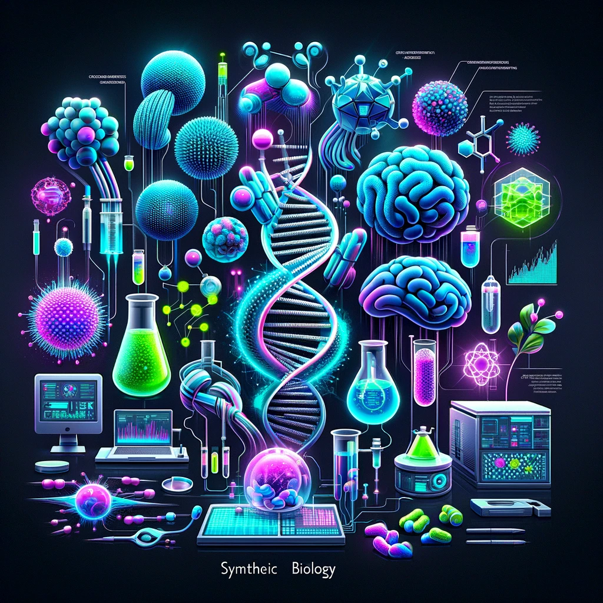

# Synthetic Biology | Bio | Quickstarts

## Examples
### Angela Belcher: Using nature to grow batteries
[Angela Belcher: Using nature to grow batteries | TED | YouTube](https://www.youtube.com/watch?v=SFW0TEFKCxk)

> Inspired by an abalone shell, Angela Belcher programs viruses to make elegant nanoscale structures that humans can use. Selecting for high-performing genes through directed evolution, she's produced viruses that can construct powerful new batteries, clean hydrogen fuels and record-breaking solar cells. At TEDxCaltech, she shows us how it's done.

### Design at the Intersection of Technology and Biology | Neri Oxman
[Design at the Intersection of Technology and Biology | Neri Oxman | TED Talks](https://www.youtube.com/watch?v=CVa_IZVzUoc)

> Designer and architect Neri Oxman is leading the search for ways in which digital fabrication technologies can interact with the biological world. Working at the intersection of computational design, additive manufacturing, materials engineering and synthetic biology, her lab is pioneering a new age of symbiosis between microorganisms, our bodies, our products and even our buildings.
