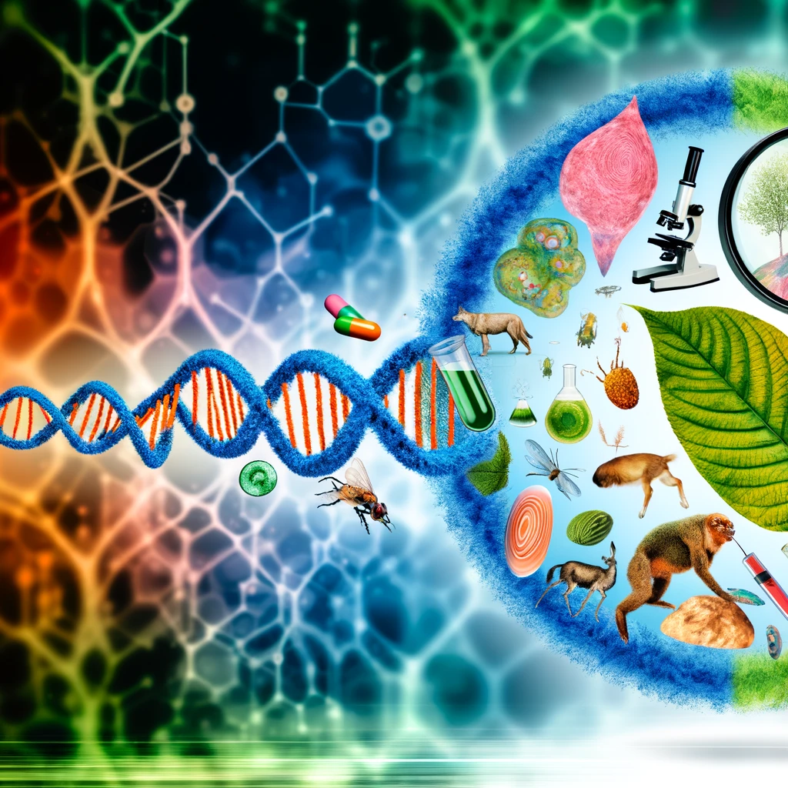

# Bio | Quickstarts
Biology (bioinformatic, biology, bio-hacking, etc) quickstarts.

## Terms
- 

## Degrees
- Ph.D. in Bioinformatics
- Mathematics (Statistics)
- Data Science
- Computer Science
- Biological Sciences

## Programming languages & other tech (most used)
- Python
- R (Rshiny)
- Shell scripting (BASH)
- Perl
- Git
- Docker (containers)
- AWS (cloud computing in general)
- HPC (high-performance computing environment)
- Linux
- Machine learning
- Modeling

## Other knownledge
- Statistics
- Data analysis
- Single cell RNAseq
- Illumina based NGS methods and tools

## Biological databases

> To search all 180 bio DBs: https://www.omicsdi.org/

- [TCGA](https://www.cancer.gov/about-nci/organization/ccg/research/structural-genomics/tcga) - *The Cancer Genome Atlas (TCGA), a landmark [cancer genomics](https://www.cancer.gov/about-nci/organization/ccg/cancer-genomics-overview) program, molecularly characterized over 20,000 primary cancer and matched normal samples spanning 33 cancer types. This joint effort between NCI and the National Human Genome Research Institute began in 2006, bringing together researchers from diverse disciplines and multiple institutions. Over the next dozen years, TCGA generated over 2.5 petabytes of genomic, epigenomic, transcriptomic, and proteomic data. The data, which has already led to improvements in our ability to diagnose, treat, and prevent cancer, will remain [publicly available](https://portal.gdc.cancer.gov/) for anyone in the research community to use.*
- [COSMIC - Catalogue of Somatic Mutations in Cancer](https://cancer.sanger.ac.uk/cosmic) - [Sanger Institute - Tool - COSMIC](https://www.sanger.ac.uk/tool/cosmic/) *COSMIC, the "Catalogue Of Somatic Mutations In Cancer" is an expert-curated database encompassing the wide variety of somatic mutation mechanisms causing human cancer.*
- [ENCODE project (Portal)](https://www.encodeproject.org/) or [Encyclopedia of DNA Elements](https://genome.ucsc.edu/ENCODE/) - [The Encyclopedia of DNA Elements (ENCODE) | NIH](https://www.genome.gov/Funded-Programs-Projects/ENCODE-Project-ENCyclopedia-Of-DNA-Elements) *The Encyclopedia of DNA Elements (ENCODE) is a public research project which aims to identify functional elements in the human genome.*
- [NCBI](https://www.ncbi.nlm.nih.gov/) - *The National Center for Biotechnology Information advances science and health by providing access to biomedical and genomic information.*
- [UCSC](http://genome.ucsc.edu/) - *It is an interactive website offering access to genome sequence data from a variety of vertebrate and invertebrate species and major model organisms, integrated with a large collection of aligned annotations. The Browser is a graphical viewer optimized to support fast interactive performance and is an open-source, web-based tool suite built on top of a MySQL database for rapid visualization, examination, and querying of the data at many levels. The Genome Browser Database, browsing tools, downloadable data files, and documentation can all be found on the UCSC Genome Bioinformatics website.*
- [EBI](https://www.ebi.ac.uk/) - *One of the roles of the EMBL-EBI is to index and maintain biological data in a set of databases, including Ensembl (housing whole genome sequence data), UniProt (protein sequence and annotation database) and Protein Data Bank (protein and nucleic acid tertiary structure database). A variety of online services and tools is provided, such as Basic Local Alignment Search Tool (BLAST) or Clustal Omega sequence alignment tool, enabling further data analysis.*
- [HMP](https://hmpdacc.org/) - *Important components of the HMP were culture-independent methods of microbial community characterization, such as metagenomics (which provides a broad genetic perspective on a single microbial community), as well as extensive whole genome sequencing (which provides a "deep" genetic perspective on certain aspects of a given microbial community, i.e. of individual bacterial species). The latter served as reference genomic sequences — 3000 such sequences of individual bacterial isolates are currently planned — for comparison purposes during subsequent metagenomic analysis. The project also financed deep sequencing of bacterial 16S rRNA sequences amplified by polymerase chain reaction from human subjects.*
- [cBioPortal](https://www.cbioportal.org) - *It is a portal...*
- [RefSeq](https://www.ncbi.nlm.nih.gov/refseq/) - *The Reference Sequence (RefSeq) database is an open access, annotated and curated collection of publicly available nucleotide sequences (DNA, RNA) and their protein products. RefSeq was first introduced in 2000. This database is built by National Center for Biotechnology Information (NCBI), and, unlike GenBank, provides only a single record for each natural biological molecule (i.e. DNA, RNA or protein) for major organisms ranging from viruses to bacteria to eukaryotes. For each model organism, RefSeq aims to provide separate and linked records for the genomic DNA, the gene transcripts, and the proteins arising from those transcripts. RefSeq is limited to major organisms for which sufficient data are available (121,461 distinct "named" organisms as of July 2022), while GenBank includes sequences for any organism submitted (approximately 504,000 formally described species).*
- [dbSNP](https://www.ncbi.nlm.nih.gov/snp/) - *dbSNP contains human single nucleotide variations, microsatellites, and small-scale insertions and deletions along with publication, population frequency, molecular consequence, and genomic and RefSeq mapping information for both common variations and clinical mutations.*
- [ClinVar](https://www.ncbi.nlm.nih.gov/clinvar/) - *ClinVar aggregates information about genomic variation and its relationship to human health.*

### Other DBs
- https://en.wikipedia.org/wiki/List_of_databases_for_oncogenomic_research
- https://en.wikipedia.org/wiki/List_of_biological_databases

## Acronyms
- *VIST:* variation, inheritance, selection and time (evolutionary principles).
- *HPC or HPCE:* high-performance computing environment.
- *NGS:* Next generation sequencing (also known as [Massive parallel sequencing](https://en.wikipedia.org/wiki/Massive_parallel_sequencing)) ([Next-Generation Sequencing (NGS) | Explore the technology](https://www.illumina.com/science/technology/next-generation-sequencing.html), [An Introduction to Tools, Databases, and Practical Guidelines for NGS Data Analysis - ScienceDirect](https://www.sciencedirect.com/science/article/pii/B9780128094143000048), [Next-Generation Sequencing for Beginners | NGS basics for researchers](https://www.illumina.com/science/technology/next-generation-sequencing/beginners.html))

## Credits
- [1kqf_opm.png](https://en.wikipedia.org/wiki/File:1kqf_opm.png)

## Resources
- http://www.biohackathon.org/
- http://togogenome.org/
### Tools
- [bio.tools](https://bio.tools/) - Search engine for Bio tools.
> The list of tools here are from job listings.
- [arriba | GitHub](https://github.com/suhrig/arriba/) - *Fast and accurate gene fusion detection from RNA-Seq data*
- [STAR-Fusion | GitHub](https://github.com/STAR-Fusion/STAR-Fusion) - *STAR-Fusion is a component of the [Trinity Cancer Transcriptome Analysis Toolkit (CTAT)](https://github.com/NCIP/Trinity_CTAT/wiki). STAR-Fusion uses the STAR aligner to identify candidate fusion transcripts supported by Illumina reads. STAR-Fusion further processes the output generated by the STAR aligner to map junction reads and spanning reads to a reference annotation set.*
- [National Cancer Informatics Program | GitHub](https://github.com/NCIP) ([datascience.cancer.gov](http://ncip.nci.nih.gov/)) - *The National Cancer Institute (NCI) coordinates the United States National Cancer Program and is part of the National Institutes of Health (NIH), which is one of eleven agencies that are part of the U.S. Department of Health and Human Services. The NCI conducts and supports research, training, health information dissemination, and other activities related to the causes, prevention, diagnosis, and treatment of cancer; the supportive care of cancer patients and their families; and cancer survivorship.*
    - [Trinity CTAT | GitHub](https://github.com/NCIP/Trinity_CTAT/) - *The Trinity Cancer Transcriptome Analysis Toolkit (CTAT) aims to provide tools for leveraging RNA-Seq to gain insights into the biology of cancer transcriptomes. Bioinformatics tool support is provided for mutation detection, fusion transcript identification, de novo transcript assembly of cancer-specific transcripts, lincRNA classification, and foreign transcript detection (viruses, microbes). CTAT is funded by the National Cancer Institute Informatics Technology for Cancer Research (NCI ITCR) program.*
- [pandas](https://pandas.pydata.org/) - *pandas is a fast, powerful, flexible and easy to use open source data analysis and manipulation tool, built on top of the Python programming language.*
    - [Python for Data Analysis: Data Wrangling with Pandas, NumPy, and IPython | Amazon](https://www.amazon.com/gp/product/1491957662/) - Related book.
- [Matplotlib: Visualization with Python](https://matplotlib.org/) - *Matplotlib is a comprehensive library for creating static, animated, and interactive visualizations in Python. Matplotlib makes easy things easy and hard things possible.*
- [SciPy](https://scipy.org/) - *Fundamental algorithms for scientific computing in Python.*
- [NCBI - National Center for Biotechnology Information/NLM/NIH | GitHub](https://github.com/ncbi)
- [Biopython Project | GitHub](https://github.com/biopython)
- [BioJava | GitHub](https://github.com/biojava)
- [Hurwitz Lab | GitHub](https://github.com/hurwitzlab)
### People
- [Kenneth Schackart  | GitHub](https://github.com/hurwitzlab)
- [Ken Youens-Clark | GitHub](https://github.com/kyclark)
### Blogs
- [Hacker Friendly](https://hackerfriendly.com/)
### Companies
- [Empirico](https://www.empiricotx.com/) - *We use huge biological datasets, human genetics, and programmable biology to power novel target discovery and development. Our dedicated team of physicians, biologists, chemists, data scientists, and drug developers is working hard to discover a new generation of therapies for patients in need.*
- [The START Center for Cancer Care in San Antonio, TX](https://www.thestartcenter.com/) - *At the START Center, we provide leading-edge cancer treatment backed by a deep commitment to advancing toward a new era in cancer care. Our team strives to offer each patient a comprehensive treatment plan that includes multi-specialty services, genetic profiling of tumors, targeted therapies, state-of-the-art treatment technology, and easy access to clinical research options.*
- [XenoSTART](https://www.xenostart.com/) - *XenoSTART is a global nonclinical oncology contract research organization focused on the development and utilization of patient-derived xenograft models. Founded in 2007, XenoSTART was created in close collaboration with The START Center, an international cancer treatment and research organization. This partnership provides the unique ability to generate clinically-relevant XenoSTART patient-derived xenograft (XPDX) models. Our XPDX models are clinically annotated and include patient treatment history and outcome and are characterized through genomic profiling, histologic analysis, and in vivo drug sensitivity to relevant standards of care. These models may be utilized in the following manner:*
    - *In vivo PK/PD and efficacy studies*
    - *In vivo efficacy panel screens (indication or target focused)*
    - *In licensing of models for internal studies*
    - *Custom model development*
    - *Orthotopic and radiotherapy studies*
    - *Ex vivo and organoid studies*
- [OHSU](https://www.ohsu.edu/) - *At OHSU, we deliver breakthroughs for better health. We're driven by the belief that better health starts with innovations in the lab, in the classroom, at the bedside and in our communities. From cancer to Alzheimer's to cardiovascular care, we collaborate every day to identify and deliver new ways to understand disease, treat illness and train the next generation of scientists and health professionals. It takes all of us - from scientists, clinicians and nurses to a top-notch professional staff.*
- [Associate Bioinformatics Analyst](https://www.aalphabio.com/) - *A-Alpha Bio is an early-stage and rapidly-growing drug discovery company headquartered in Seattle, WA. We are enabling the next generation of high-impact therapeutics with synthetic biology and machine learning. We partner with leading pharma and biotech companies to enable the discovery of antibodies, molecular glues, and other protein interaction-related drugs.*
- [FreshWindBioTech](https://www.freshwindbiotech.com/) - *We were a group of young and bright PhD students at Baylor College of Medicine with the same inspiration of improving the outcomes of cancer patients. Now we grow up to a group of experienced and intelligent scientists, investors and entrepreneurs, aiming to realize our dreams of bringing effective and safe personalized therapies to cancer patients.*
    - *Fresh Wind Biotechnologies, Inc. is developing innovative and potent cellular immunotherapies to enhance cancer patient's every day experiences. Founded in 2020, our incredible team of scientists, clinicians, bioinformaticians and business development experts have worked tirelessly to bring our company to the forefront of the fight against cancer. We dedicate our resources to develop and to commercialize highly effective and safe personalized cancer treatment. We focus on integration of high-throughput platforms,  state-of-art data science and engineering, and innovative cellular therapy technologies to advance precision oncology.*
    - *Adoptive cell therapy (ACT) utilizes and enhances the cells of our own immune system to eliminate cancer. Naturally occurring T cells in cancer patients are often capable of targeting their cancers cells.*
- [Valted Seq](https://www.valtedseq.com/) - *Home of the world’s largest repository of single-cell sequencing data for neurodegenerative diseases.*
    - *Valted Seq is a discovery stage biopharmaceutical company spearheaded by world-renowned scientists Dr. Ted Dawson and Dr. Valina Dawson of Johns Hopkins University. The company was founded on the belief that a deeper understanding of neurodegenerative pathways is essential to develop precision therapeutics and identify novel biomarkers for some of the most challenging neurodegenerative diseases, including Alzheimer’s and Parkinson’s. Valted Seq is part of the [D&D Pharmatech](http://www.ddpharmatech.com/)/[Neuraly](http://neuralymed.com/) family of companies, which works hand in hand with leading medical research institutions to advance groundbreaking healthcare innovations.*
    - **Blog post on Valted Seq:** https://www.businesswire.com/news/home/20200909005093/en/DD-Pharmatech-Announces-Launch-Valted-Seq-S
- [D&D pharmatech](http://ddpharmatech.com/) - *D&D Pharmatech is a clinical-stage global biotech company that funds the development of revolutionary medicines through disease-specific subsidiary companies founded and guided by top-tier medical research faculty. This corporate structure creates a unique opportunity to accelerate translation of cutting-edge research into lifesaving therapeutic products for patients. The company’s product pipeline focuses on a range of indications including neurodegenerative and fibrotic diseases as well as application of big data in CNS drug research and diagnostics. D&D Pharmatech is the parent company of U.S.-based Neuraly, Precision Molecular, Valted Seq, Theraly Fibrosis and P4 Microbiome.*
- [Morgridge Institute for Research](https://morgridge.org/) - *The Morgridge Institute for Research is a nonprofit biomedical institute exploring uncharted scientific territory to discover tomorrow’s cures. Morgridge works to improve human health through innovative, interdisciplinary biomedical discoveries, spark scientific curiosity and serve society through translational outcomes, in partnership with the University of Wisconsin-Madison. Research areas include regenerative biology and bioinformatics, virology, medical engineering, metabolism, core computational technology and bioethics.*
- [Bionano Genomics | Structural Variation Detection with Optical Genome Mapping](https://bionanogenomics.com/) - *At Bionano Genomics®, we are committed to unlocking understanding of genome biology to advance the promise of genomics in areas including cancer and human disease, agricultural bioengineering and genome discovery. Our team is not afraid to venture into uncharted territory to look for answers. We welcome the curious and provide a place where those who are not satisfied with the status quo can feel at home. Our next-generation genome mapping and analysis tools help researchers see true genome structure to fill in what’s missing from sequencing-based data. Saphyr™, our high-speed, high-throughput whole genome mapping solution, offers unmatched structural variation discovery capabilities and the ability to construct the most complete genome assemblies. At Bionano, we are invested in the success of our customers and users around the world, and are dedicated to supporting them with the tools, resources and support they need to achieve their goals and make a real impact on improving quality of life for all.*
- [Axle Informatics](https://axleinfo.com/) - *Axle Informatics is a bioscience and information technology company that offers advancements in translational research, health informatics, and data science applications to research centers and healthcare organizations around the globe. With experts in biomedical science, software engineering, and program management, we develop and apply research tools and techniques that empower decision-making and accelerate research discoveries. We work with some of the top research organizations and facilities in the country including multiple institutes at the National Institutes of Health (NIH) by offering the responsiveness of a small business coupled with the experience, breadth, and depth of a large organization.*
- [University of Arizona](https://www.arizona.edu/) - *The University of Arizona is the leading public research university in the American Southwest. The UA produces more than $600 million in annual research and is the state's only member of the prestigious Association of American Universities. This is a diverse community of people who thrive on innovation and collaboration. Our world-class faculty create discoveries that improve the human condition and fuel the state's economy. Our research enterprise provides undergraduate students with opportunities for hands-on experiences that can be found in few universities in the world. As the state's land-grant university, our research and resources enrich communities around the state and around the world.*
- [Codiak BioSciences](https://www.codiakbio.com/) - *Codiak is a clinical-stage biopharmaceutical company focused on pioneering the development of exosome-based therapeutics, a new class of medicines with the potential to transform the treatment of a wide spectrum of diseases with high unmet medical need. By leveraging the biology of exosomes as natural intercellular transfer mechanisms, Codiak has developed its proprietary engEx Platform to expand upon the innate properties of exosomes to design, engineer and manufacture novel exosome therapeutic candidates. Codiak has utilized its engEx Platform to generate a deep pipeline of engineered exosomes aimed at treating a broad range of disease areas, spanning oncology, neuro-oncology, neurology, neuromuscular disease and infectious disease.*
- [ReviveMed](https://www.revivemed.io/) - *ReviveMed is an MIT spinout that created the world's most advanced AI platform and a proprietary database with the highest quality and density of metabolite data. While current methods are limited to a few hundred metabolite data points at the most, ReviveMed uses data from 10,000+ metabolites. As a result, in a fraction of the time and cost, we have discovered therapeutic assets for four diseases internally, including NASH and renal cell carcinoma, and in strategic collaboration with big pharma, with a combined therapeutic market value of >$50B. Over the next five years, ReviveMed is poised to revolutionize the drug discovery market by collecting data from 50 more diseases and creating billions in therapeutic value.*
