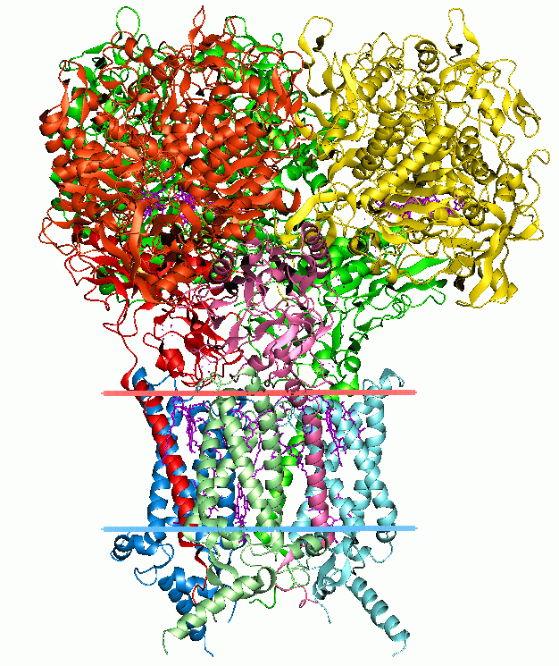

# bio-quickstarts
Biology (bioinformatic, biology, bio-hacking, etc) quickstarts.

## Acronyms
- *VIST:* variation, inheritance, selection and time (evolutionary principles).
- *HPC or HPCE:* high-performance computing environment.

## Credits
- [1kqf_opm.png](https://en.wikipedia.org/wiki/File:1kqf_opm.png)

## Resources
### Tools
- [bio.tools](https://bio.tools/) - Search engine for Bio tools.
> The list of tools here are from job list.
- [arriba | GitHub](https://github.com/suhrig/arriba/) - *Fast and accurate gene fusion detection from RNA-Seq data*
- [STAR-Fusion | GitHub](https://github.com/STAR-Fusion/STAR-Fusion) - *STAR-Fusion is a component of the [Trinity Cancer Transcriptome Analysis Toolkit (CTAT)](https://github.com/NCIP/Trinity_CTAT/wiki). STAR-Fusion uses the STAR aligner to identify candidate fusion transcripts supported by Illumina reads. STAR-Fusion further processes the output generated by the STAR aligner to map junction reads and spanning reads to a reference annotation set.*
- [National Cancer Informatics Program | GitHub](https://github.com/NCIP) ([datascience.cancer.gov](http://ncip.nci.nih.gov/)) - *The National Cancer Institute (NCI) coordinates the United States National Cancer Program and is part of the National Institutes of Health (NIH), which is one of eleven agencies that are part of the U.S. Department of Health and Human Services. The NCI conducts and supports research, training, health information dissemination, and other activities related to the causes, prevention, diagnosis, and treatment of cancer; the supportive care of cancer patients and their families; and cancer survivorship.*
    - [Trinity CTAT | GitHub](https://github.com/NCIP/Trinity_CTAT/) - *The Trinity Cancer Transcriptome Analysis Toolkit (CTAT) aims to provide tools for leveraging RNA-Seq to gain insights into the biology of cancer transcriptomes. Bioinformatics tool support is provided for mutation detection, fusion transcript identification, de novo transcript assembly of cancer-specific transcripts, lincRNA classification, and foreign transcript detection (viruses, microbes). CTAT is funded by the National Cancer Institute Informatics Technology for Cancer Research (NCI ITCR) program.*
- [pandas](https://pandas.pydata.org/) - *pandas is a fast, powerful, flexible and easy to use open source data analysis and manipulation tool, built on top of the Python programming language.*
    - [Python for Data Analysis: Data Wrangling with Pandas, NumPy, and IPython | Amazon](https://www.amazon.com/gp/product/1491957662/) - Related book.
- [Matplotlib: Visualization with Python](https://matplotlib.org/) - *Matplotlib is a comprehensive library for creating static, animated, and interactive visualizations in Python. Matplotlib makes easy things easy and hard things possible.*
- [SciPy](https://scipy.org/) - *Fundamental algorithms for scientific computing in Python.*
### Blogs
- [Hacker Friendly](https://hackerfriendly.com/)
### Companies
- [Empirico](https://www.empiricotx.com/) - *We use huge biological datasets, human genetics, and programmable biology to power novel target discovery and development. Our dedicated team of physicians, biologists, chemists, data scientists, and drug developers is working hard to discover a new generation of therapies for patients in need.*
- [The START Center for Cancer Care in San Antonio, TX](https://www.thestartcenter.com/) - *At the START Center, we provide leading-edge cancer treatment backed by a deep commitment to advancing toward a new era in cancer care. Our team strives to offer each patient a comprehensive treatment plan that includes multi-specialty services, genetic profiling of tumors, targeted therapies, state-of-the-art treatment technology, and easy access to clinical research options.*
- [XenoSTART](https://www.xenostart.com/) - *XenoSTART is a global nonclinical oncology contract research organization focused on the development and utilization of patient-derived xenograft models. Founded in 2007, XenoSTART was created in close collaboration with The START Center, an international cancer treatment and research organization. This partnership provides the unique ability to generate clinically-relevant XenoSTART patient-derived xenograft (XPDX) models. Our XPDX models are clinically annotated and include patient treatment history and outcome and are characterized through genomic profiling, histologic analysis, and in vivo drug sensitivity to relevant standards of care. These models may be utilized in the following manner:*
    - *In vivo PK/PD and efficacy studies*
    - *In vivo efficacy panel screens (indication or target focused)*
    - *In licensing of models for internal studies*
    - *Custom model development*
    - *Orthotopic and radiotherapy studies*
    - *Ex vivo and organoid studies*
- [OHSU](https://www.ohsu.edu/) - *At OHSU, we deliver breakthroughs for better health. We're driven by the belief that better health starts with innovations in the lab, in the classroom, at the bedside and in our communities. From cancer to Alzheimer's to cardiovascular care, we collaborate every day to identify and deliver new ways to understand disease, treat illness and train the next generation of scientists and health professionals. It takes all of us - from scientists, clinicians and nurses to a top-notch professional staff.*
- [Associate Bioinformatics Analyst](https://www.aalphabio.com/) - *A-Alpha Bio is an early-stage and rapidly-growing drug discovery company headquartered in Seattle, WA. We are enabling the next generation of high-impact therapeutics with synthetic biology and machine learning. We partner with leading pharma and biotech companies to enable the discovery of antibodies, molecular glues, and other protein interaction-related drugs.*
- [FreshWindBioTech](https://www.freshwindbiotech.com/) - *We were a group of young and bright PhD students at Baylor College of Medicine with the same inspiration of improving the outcomes of cancer patients. Now we grow up to a group of experienced and intelligent scientists, investors and entrepreneurs, aiming to realize our dreams of bringing effective and safe personalized therapies to cancer patients.*
    - *Fresh Wind Biotechnologies, Inc. is developing innovative and potent cellular immunotherapies to enhance cancer patient's every day experiences. Founded in 2020, our incredible team of scientists, clinicians, bioinformaticians and business development experts have worked tirelessly to bring our company to the forefront of the fight against cancer. We dedicate our resources to develop and to commercialize highly effective and safe personalized cancer treatment. We focus on integration of high-throughput platforms,  state-of-art data science and engineering, and innovative cellular therapy technologies to advance precision oncology.*
    - *Adoptive cell therapy (ACT) utilizes and enhances the cells of our own immune system to eliminate cancer. Naturally occurring T cells in cancer patients are often capable of targeting their cancers cells.*
