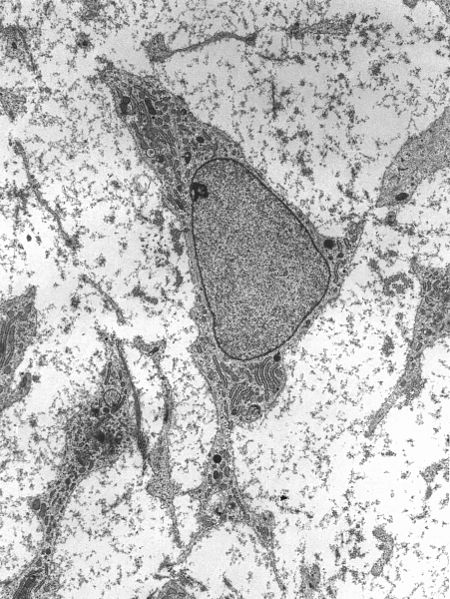

# Stem Cell | Bio | Quickstarts

## Overview of Isolating Stem Cells from Umbilical Cord Tissue
Isolating stem cells from umbilical cord tissue involves several critical steps that require specialized equipment, sterile conditions, and professional expertise. The process is typically carried out in accredited laboratories by trained personnel to ensure safety and compliance with regulatory standards.

### Key Steps and Required Equipment

<table>
 <tr>
  <th>Step</th>
  <th>Description</th>
  <th>Equipment Needed</th>
 </tr>
 <tr>
  <td>1. Collection of Umbilical Cord Tissue</td>
  <td>After childbirth, the umbilical cord is clamped, cut, and collected with informed consent.</td>
  <td>- Sterile collection kits
- Personal Protective Equipment (PPE)
- Consent forms
  </td>
 </tr>
 <tr>
  <td>2. Transportation to Laboratory</td>
  <td>The tissue is transported under controlled conditions to preserve cell viability.</td>
  <td>- Temperature-controlled transport containers
- Sterile packaging materials
  </td>
 </tr>
 <tr>
  <td>3. Preparation and Sterilization</td>
  <td>The umbilical cord is cleaned and sterilized to remove contaminants.</td>
  <td>- Laminar flow hood (biosafety cabinet)
- Sterile saline solutions
- Disinfectants (e.g., ethanol)
  </td>
 </tr>
 <tr>
  <td>4. Tissue Dissection</td>
  <td>The cord tissue is dissected to isolate specific regions rich in stem cells (e.g., Wharton's Jelly).</td>
  <td>- Sterile surgical instruments (scalpels, scissors, forceps)
- Petri dishes
- Microscope
   </td>
  </tr>
  <tr>
   <td>5. Enzymatic Digestion</td>
   <td>Enzymes are used to break down the extracellular matrix to release the cells.</td>
   <td>- Enzymes (e.g., collagenase, hyaluronidase)
- Incubator shaker
- Centrifuge tubes
   </td>
  </tr>
   <td>6. Centrifugation and Washing</td>
   <td>Cells are separated from the solution and washed to remove enzymes and debris.</td>
   <td>- Centrifuge
- Sterile buffers (e.g., phosphate-buffered saline)
- Pipettes and tips
   </td>
  </tr>
   <td>7. Cell Culture Initiation</td>
   <td>Isolated cells are cultured in specific media to promote growth and proliferation.</td>
   <td>- Cell culture flasks or plates
- Stem cell culture media with supplements
- CO₂ incubator
   </td>
  </tr>
  <tr>
   <td>8. Monitoring and Expansion</td>
   <td>Cells are regularly monitored, and the culture is expanded to obtain sufficient cell numbers.</td>
   <td>- Inverted microscope
- Hemocytometer or cell counter
- Media change supplies
   </td>
  </tr>
  <tr>
   <td>9. Characterization and Quality Control</td>
   <td>Cells are tested for stem cell markers, viability, and sterility.</td>
   <td>- Flow cytometer
- PCR equipment for genetic analysis
- Microbiological testing kits
   </td>
  </tr>
  <tr>
   <td>10. Cryopreservation (Optional)</td>
   <td>Cells are preserved for future use by controlled freezing.</td>
   <td>
- Cryoprotective agents (e.g., DMSO)
- Controlled-rate freezer
- Liquid nitrogen storage tanks
   </td>
  </tr>
  <tr>
   <td>11. Documentation and Compliance</td>
   <td>Detailed records are maintained for regulatory compliance and traceability.</td>
   <td>- Laboratory information management system (LIMS)
- Standard operating procedures (SOPs)
- Compliance checklists
   </td>
  </tr>
</table>

### Detailed Explanations
- Step 1: Collection of Umbilical Cord Tissue
    - Consent and Ethics: Prior to collection, informed consent must be obtained from the mother. Ethical guidelines and legal regulations govern the collection and use of human tissues.
    - Sterile Techniques: Use of sterile collection kits and PPE is essential to prevent contamination.

- Step 2: Transportation to Laboratory
    - Temperature Control: The tissue must be kept at optimal temperatures (usually 2–8°C) during transport.
    - Time Sensitivity: Prompt transportation minimizes cell degradation.

- Step 3: Preparation and Sterilization
    - Biosafety Cabinet: A laminar flow hood provides a sterile environment for handling tissues.
    - Cleaning Procedures: The umbilical cord is rinsed with sterile saline and disinfectants to remove blood and contaminants.

- Step 4: Tissue Dissection
    - Isolation of Target Tissue: Regions like Wharton's Jelly are rich in mesenchymal stem cells.
    - Microscopic Examination: Ensures accurate dissection and quality of tissue samples.

- Step 5: Enzymatic Digestion
    - Enzyme Selection: Collagenase and hyaluronidase help break down connective tissues.
    - Incubation: The tissue is incubated with enzymes at specific temperatures and durations.

- Step 6: Centrifugation and Washing
    - Cell Separation: Centrifugation separates cells from the digestion mixture.
    - Washing Steps: Multiple washes remove residual enzymes and impurities.

- Step 7: Cell Culture Initiation
    - Culture Media: Specialized media provide nutrients and growth factors for stem cells.
    - Incubation Conditions: CO₂ incubators maintain appropriate temperature, humidity, and gas concentrations.

- Step 8: Monitoring and Expansion
    - Regular Observation: Cells are checked for morphology and confluence.
    - Passaging Cells: Cells are sub-cultured to new flasks to prevent overgrowth.

- Step 9: Characterization and Quality Control
    - Marker Analysis: Flow cytometry identifies stem cell surface markers.
    - Genetic Stability: PCR and other assays check for genetic integrity.
    - Sterility Testing: Ensures cultures are free from microbial contamination.

- Step 10: Cryopreservation
    - Freezing Protocols: Controlled-rate freezing prevents ice crystal formation that can damage cells.
    - Storage: Liquid nitrogen tanks keep cells at ultra-low temperatures for long-term preservation.

- Step 11: Documentation and Compliance
    - Record-Keeping: Accurate documentation is crucial for traceability and regulatory audits.
    - Regulatory Bodies: Compliance with agencies like the FDA or EMA is mandatory.

## Copyright
- https://en.wikipedia.org/wiki/File:MSC_high_magnification.jpg
